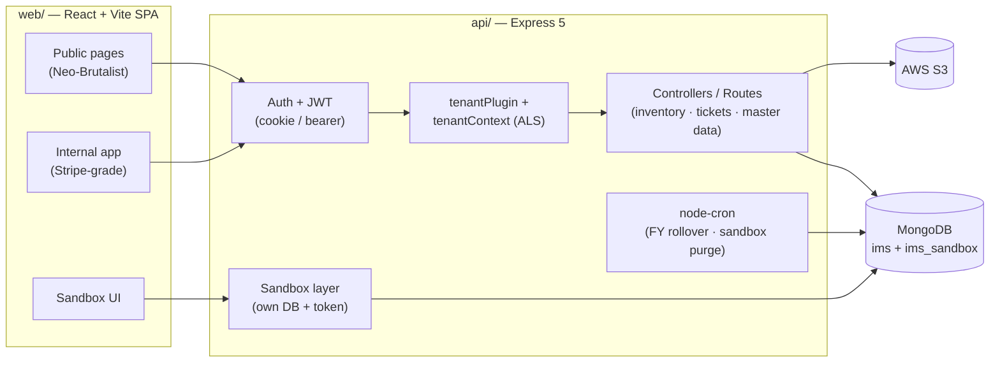

<div align="center">

  

  <h1>Omnify</h1>

  <p><strong>Multi-tenant inventory & support-ticketing SaaS — stock movements, warehouses, and customer tickets for operations teams.</strong></p>

  <!-- status -->
  
  
  

  <br/>

  <!-- frontend -->
  
  
  
  
  

  <br/>

  <!-- backend -->
  
  
  
  
  

</div>

---

> Omnify is a multi-tenant SaaS for running an inventory and field-support operation: track stock in/out, warehouses, stores, and per-item stock ledgers, while a built-in ticketing module handles customer issues and support staff. A fully isolated, self-resetting sandbox lets prospects try the product on realistic seed data without signing up.

##  About

Omnify is a two-part application — a React/TypeScript single-page app (`web/`) and an Express + MongoDB API (`api/`).

The API is **multi-tenant by construction**: a global Mongoose `tenantPlugin` scopes every query to the current tenant, and an `AsyncLocalStorage` tenant context (`src/context/tenantContext.js`) carries the active tenant through each request — so the same controllers and models serve every tenant without per-tenant code. A super-admin console manages tenants; each tenant's users sign in with JWTs (access cookie + refresh).

On top of that, Omnify covers the full operational loop:

- **Inventory** — items and item groups, stock-in / stock-out activity (with categories), stock items, warehouses, stores, and a per-item **stock-record ledger** that rolls over each tenant's financial year automatically.
- **Support** — tickets with issue types, resolution / delivery / installation statuses, support persons (rated from their tickets) and assignment, plus a public ticket-status lookup.
- **Master data** — cities, states, parties, resellers, agencies, and logistics-provider categories.
- **Demo sandbox** — an isolated database (`ims_sandbox`) seeded with realistic US data, gated by a short-lived (6h), server-authoritative token, with expired sessions purged on a cron.

The web app is intentionally **two design languages**: public/marketing pages follow an Engineering Neo-Brutalist style (`docs/DESIGN-PUBLIC.md`) and the internal product app follows a calm, Stripe-grade system (`docs/DESIGN-INTERNAL.md`).

##  Features

- **Multi-tenant isolation** — global tenant plugin + `AsyncLocalStorage` context scope all data per tenant; no per-tenant forks of logic.
- **Super-admin console** — provision and manage tenants via `/api/admin/tenants`.
- **JWT auth** — access + refresh tokens, HTTP-only cookies, and a rate-limited login endpoint (`express-rate-limit`).
- **Inventory & stock ledger** — items, groups, stock in/out, stock items, warehouses, stores, and an item stock-record ledger with opening/closing balances.
- **Financial-year rollover** — a daily `node-cron` job closes each tenant's records on the eve of its FY start month and carries remaining stock forward.
- **Support ticketing** — tickets, statuses, issue types, support-person ratings, assignment, and a public status-check page.
- **Image uploads** — `multer` ingest with AWS S3 storage and presigned URLs.
- **Real-time ready** — `socket.io` server wired into the HTTP server.
- **Self-resetting sandbox** — isolated DB, seeded US demo data, 6-hour tamper-proof token, and a purge cron for expired sessions.
- **Excel export** — report/data export via `exceljs` on the frontend.

##  Tech Stack

- **Frontend:** React 19, TypeScript, Vite 7, MUI v7 (+ MUI X date pickers), Tailwind CSS v4, React Router v7, TanStack Query, React Hook Form + Yup, Framer Motion, date-fns, ExcelJS, lucide-react.
- **Backend:** Node.js (20+), Express 5, Mongoose 8 (`mongoose-sequence`), JWT (`jsonwebtoken`), `bcryptjs`, `socket.io`, `node-cron`, `express-validator`, `express-rate-limit`, `multer`.
- **Database:** MongoDB (primary tenant DB + a separate `ims_sandbox` database).
- **Infra / Tooling:** AWS S3 (`@aws-sdk/client-s3` + presigner) for image storage, GitHub Actions → AWS Elastic Beanstalk deploy, ESLint, TypeScript `tsc -b`.

##  Architecture



- **Plugin registration runs first.** `src/index.js` imports `bootstrap/registerPlugins.js` before any model, so `tenantPlugin` is applied globally to every schema.
- **Per-request tenant scoping.** `runWithTenant()` (AsyncLocalStorage) sets the active tenant; the plugin transparently filters reads/writes — controllers stay tenant-agnostic.
- **Sandbox is a separate plane.** Mounted at `/sandbox` with its own database and a server-authoritative session token (expiry validated against a DB session record, not trusted from the JWT claim), so a tampered token cannot extend access.
- **Scheduler.** `services/scheduler.js` registers cron jobs (daily FY rollover; periodic sandbox purge) at startup.

##  Project Structure

```
inventory-solution-SaaS/
├── api/                     # Express 5 + Mongoose backend
│   ├── src/
│   │   ├── index.js         # app entry: CORS, routes, server start
│   │   ├── bootstrap/       # registerPlugins.js (must load before models)
│   │   ├── config/          # db.js (Mongo connect), s3.js
│   │   ├── context/         # tenantContext.js (AsyncLocalStorage)
│   │   └── sandbox/         # sandbox DB / context helpers
│   ├── models/              # Mongoose schemas (+ plugins/tenantPlugin.js)
│   ├── controllers/         # per-entity controllers (incl. sandbox/, admin/)
│   ├── routes/              # per-entity Express routers
│   ├── middleware/          # auth, sandbox auth, etc.
│   ├── services/            # scheduler.js (cron jobs)
│   ├── scripts/             # seedSandbox.js
│   └── .env.example
└── web/                     # React 19 + Vite frontend
    ├── src/
    │   ├── pages/           # internal pages + public/ + admin/
    │   ├── components/      # common, form, filter, applayout, public, shared
    │   ├── contexts/        # tenant settings, auth, etc.
    │   ├── api/             # axios clients (app + sandbox)
    │   ├── sandbox/         # token-backed sandbox mode
    │   └── theme/           # tokens.ts / theme.ts (internal design system)
    ├── public/              # IMS.png logo, static assets
    └── .env.example
```

##  Getting Started

### Prerequisites

- **Node.js 20+** and npm
- **MongoDB** running locally or a connection string (e.g. `mongodb://127.0.0.1:27017`)
- (Optional) **AWS S3** bucket + credentials for image uploads

### Installation

```bash
git clone <repo-url> inventory-solution-SaaS
cd inventory-solution-SaaS

# backend
cd api && npm install

# frontend
cd ../web && npm install
```

### Environment

Backend — copy `api/.env.example` to `api/.env`:

| Variable | Description | Required |
|---|---|---|
| `PORT` | API listen port (defaults to `3000` if unset) | No |
| `MONGO_URI` | MongoDB connection string | Yes |
| `JWT_SECRET` | Secret for signing auth JWTs | Yes |
| `SANDBOX_DB_NAME` | Database name for the isolated sandbox (e.g. `ims_sandbox`) | For sandbox |
| `SANDBOX_JWT_SECRET` | Secret for signing sandbox session tokens | For sandbox |
| `S3_BUCKET_NAME` | S3 bucket for image uploads | For uploads |
| `AWS_REGION` | AWS region | For uploads |
| `AWS_ACCESS_KEY_ID` | AWS access key | For uploads |
| `AWS_SECRET_ACCESS_KEY` | AWS secret key | For uploads |

<!-- TODO: confirm exact sandbox env var names in api/middleware/sandboxAuth.js / sandboxDb.js -->

Frontend — copy `web/.env.example` to `web/.env`:

| Variable | Description | Required |
|---|---|---|
| `VITE_API_BASE_URL` | Base URL of the API (omit to use the app default) | No |

### Running

```bash
# API (from api/)
npm run dev            # node src/index.js  →  http://localhost:<PORT>
npm run seed:sandbox   # seed the isolated sandbox database

# Frontend (from web/)
npm run dev            # Vite dev server  →  http://localhost:5173
npm run build          # tsc -b && vite build
npm run preview        # preview the production build
```

##  API Reference

The API mounts most entity routers at the root path; below is a representative slice. Each inventory / master-data / ticket entity exposes standard CRUD routes.

| Method | Endpoint | Description |
|---|---|---|
| `GET` | `/health` | Health check |
| `POST` | `/api/login` | Authenticate (rate-limited), set auth cookie |
| `POST` | `/api/refresh` | Issue a new access token from the refresh token |
| `POST` | `/api/logout` | Clear auth session |
| `GET` | `/api/verify` | Verify the current token |
| `GET` / `PUT` | `/users` · `/users/:id` | Manage users (auth required) |
| `*` | `/api/admin/tenants` | Super-admin tenant management |
| `*` | `/sandbox/*` | Sandbox session + demo CRUD (sandbox token required) |
| `*` | `/items`, `/stockIn`, `/stockOut`, `/stockItem`, `/store`, `/warehouse`, `/itemStockRecord`, `/ticket`, `/supportPerson`, ... | Inventory, support, and master-data CRUD |

<details>
<summary>Entities with CRUD routers</summary>

`agency`, `assignedTo`, `city`, `deliveryStatus`, `installationStatus`, `issueType`, `item`, `itemGroup`, `itemStockRecord`, `logisticsProviderCategory`, `party`, `reseller`, `resolutionStatus`, `state`, `stockIn`, `stockInCategory`, `stockItem`, `stockOut`, `stockOutCategory`, `store`, `supportPerson`, `ticket`, `ticketStatus`, `warehouse`, plus image upload and tenant routes.

</details>

##  Configuration

- **CORS** allow-list is defined in `api/src/index.js` (`http://localhost:5173` and the production hosts) — update it for new environments.
- **Cron schedules** live in `api/services/scheduler.js` (daily FY rollover; sandbox purge).
- **Design systems** are documented in `docs/DESIGN-PUBLIC.md` and `docs/DESIGN-INTERNAL.md`; the internal theme source of truth is `web/src/theme/`.

##  Testing

No automated test suite is configured yet — `npm test` in `api/` is a placeholder. Frontend linting:

```bash
cd web && npm run lint
```

<!-- TODO: add a real test runner (api + web) -->

##  Deployment

A GitHub Actions workflow (`api/.github/workflows/main.yml`) packages the backend and deploys it to **AWS Elastic Beanstalk** on push to `main` (Node 20). The frontend builds to static assets via `npm run build` for hosting on any static/CDN host.

---
